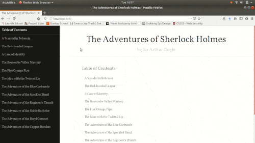

# Sherlock Book Viewer #

A very simple web application for viewing the *Sherlock Holmes* book. It
allows readers to view specific chapters and paragraphs by searching for
phrases present in the book.

  

To run this server locally, just install the dependencies with `bundle
install` and then run `rackup`.
